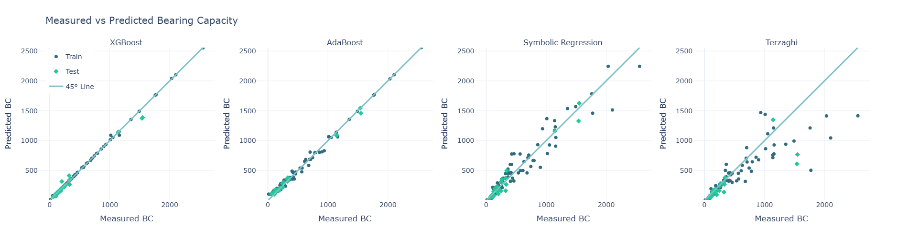
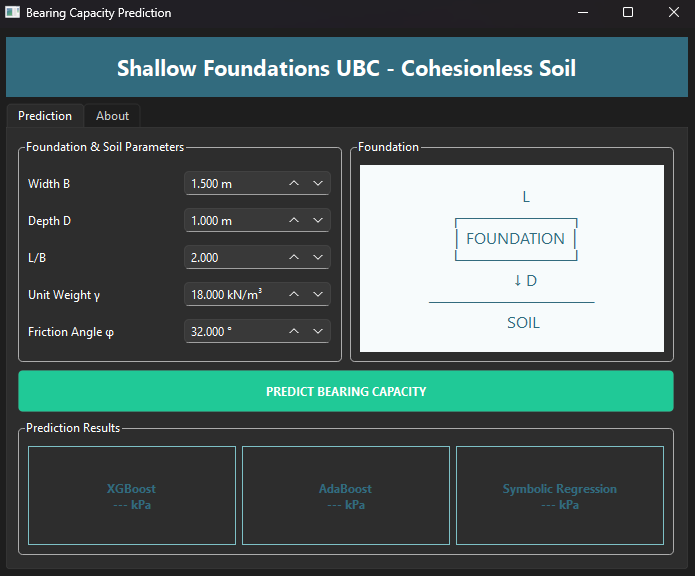

# Ultimate Bearing Capacity Prediction

A machine learning and symbolic regression project for predicting the ultimate bearing capacity of shallow foundations on cohesionless soil.

## Project Overview

The project investigates the relationship between foundation and soil parameters and the ultimate bearing capacity (BC) using machine learning models and symbolic regression.

The main input parameters are:

* `B` — Foundation width
* `D` — Foundation depth
* `g` — Soil unit weight
* `phi` — Soil friction angle
* `L/B` — Foundation length-to-width ratio

The project includes data preprocessing, exploratory data analysis, machine learning model development, model evaluation, and symbolic regression for generating an interpretable mathematical equation.

## Models

The following approaches are investigated:

* XGBoost Regression
* AdaBoost Regression
* Symbolic Regression

The trained models are saved in `UBC_models.pkl`.

## Exploratory Data Analysis

### Feature Distributions


### Feature Boxplots


### Feature Correlation


## Model Results



## Graphical User Interface

`UBC-GUI.py` provides a graphical interface for entering the foundation and soil parameters and obtaining bearing-capacity predictions.



## Repository Structure

```text
Ultimate-Bearing-Capacity-Prediction/
│
├── images/
│   ├── Features Distribution.png
│   ├── Features BoxPlot.png
│   ├── Features Correlation.png
│   └── Models.png
│
├── README.md
├── UBC-GUI.py
├── UBC-Prediction.ipynb
├── UBC_models.pkl
└── merged_BC_dataset.csv
```

## Requirements

The project is implemented in Python using libraries including:

```text
Python
Pandas
NumPy
Scikit-learn
XGBoost
PySR
PySide6
Matplotlib
```

## Usage

The Jupyter Notebook `UBC-Prediction.ipynb` contains the data analysis, model training, evaluation, and symbolic regression workflow.

To run the graphical interface:

```bash
python UBC-GUI.py
```

## Purpose

This project is developed for research and educational purposes to investigate machine learning and symbolic regression approaches for ultimate bearing capacity prediction.
